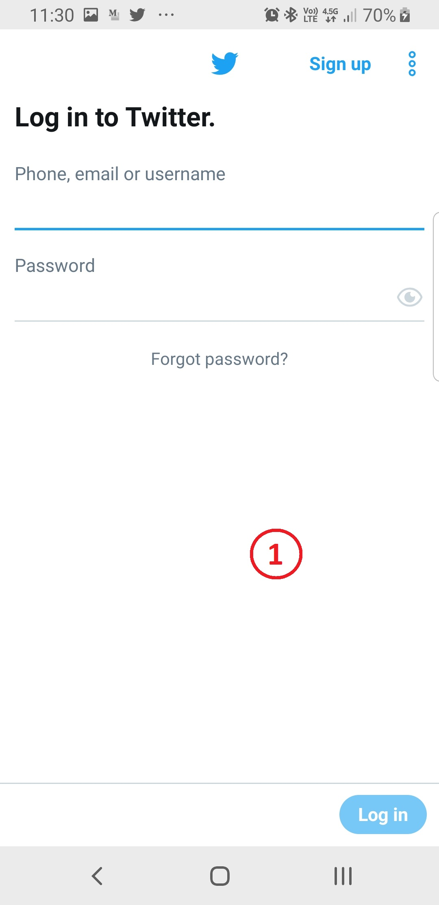

# User Interface

UI Overview

1. Login
2. User Profile
3. Tweet list
4. Tweet options / actions
5. Tweet text
6. Tweet image
7. Form comment / reply
8. Comment List
9. Image dialog

 (Twitter for Android screenshots)

